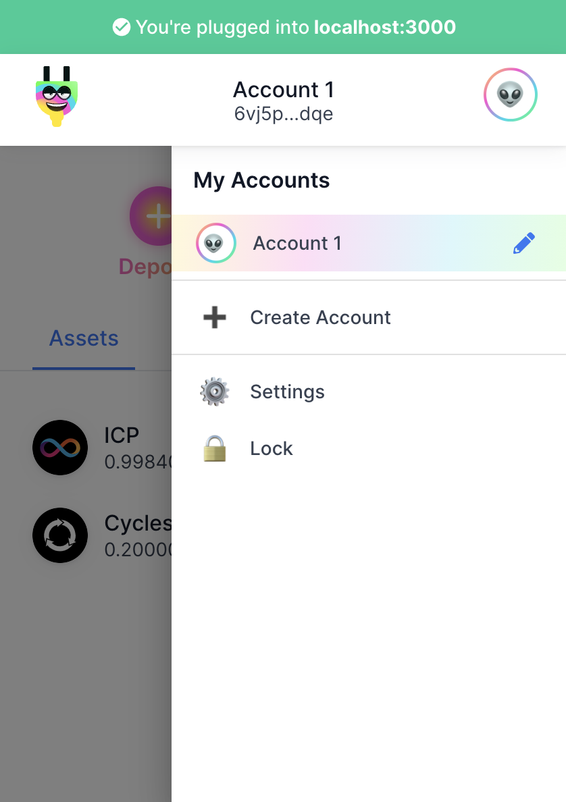
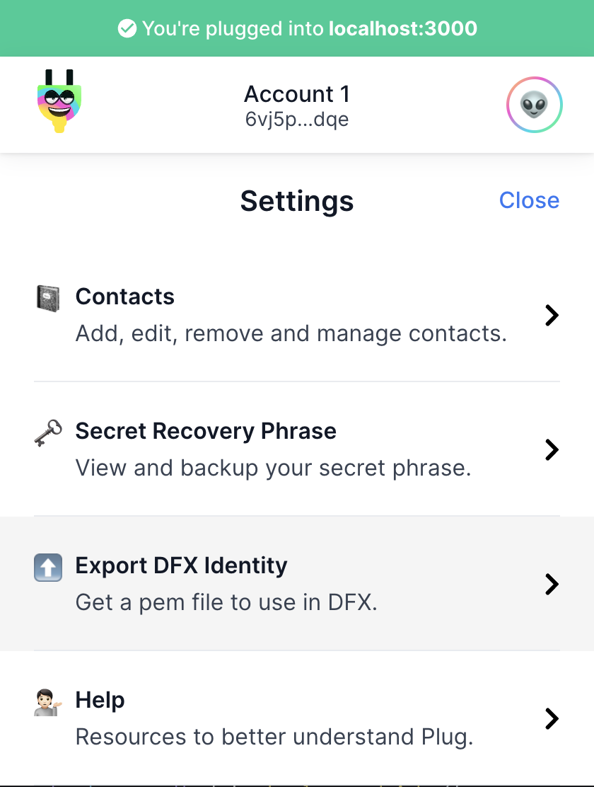

# 🤖 DFX

## 📒 Table of Contents 

- [DFX Identity](#-dfx-identity)
  - [Export PEM file](#-export-pem-file)
  - [Import PEM file to dfx](#-import-the-pem-file-in-the-dfx-cli)
- [Troubleshooting](#-troubleshooting)
- [Conclusion](#-conclusion)

## 👨🏽‍🦰 DFX Identity

When deploying a local canister, the local wallet is set as the controller and dfx proxy calls through the wallet into the canister.

The interactions we make through the Plug API uses the identity we have setup or configured (e.g. importing the passphrase or by creating a new wallet).

As such, we have two different identities in-place, the local replica's wallet vs the one used when making calls in the Frontend app.

To setup the same identity in both instances, we use the `dfx identity` through the DFX CLI by providing a pem file from the Plug browser extension.

### Export PEM file

Assuming that you are authenticated in Plug, click in the top right corner to access `My accounts`:

<div align="left">
  
</div>

Followed by the export dfx identity (keep the file safe, you'll also need to know the pathname as you'll pass it to the DFX CLI):

<div align="left">
  
</div>

### Import the PEM file in the DFX CLI

Import the identity via the `dfx cli` by providing a custom name and the PEM file location (e.g. ~/Downloads/pem-identity.cer):

```sh
dfx identity import <PROVIDE A NAME> <PATH TO THE PEM FILE>
```

You can then set the identity to use when running the dfx commands, as:

```sh
dfx identity use <NAME>
```

**Alternatively**, keep the default identity the local replica provides by default and set the identity when calling the service, this can be useful when dealing with multiple dev environments where you don't want to use the Plug identity in each call. Here's an example when making a service call:

```sh
dfx --identity <NAME> canister call <CANISTER NAME or ID> <METHOD NAME> 
```

Let's say I have a identity called "my-plug", so here's a use case where I'd call a pseudo canister named "foobar":

```sh
dfx --identity my-plug canister call foobar say_hello "()"
```

Confirm that the identity is the same you have on your Plug wallet (top-center):

```sh
dfx identity get-principal
```

Great! Now the correct identity can be used accross the frontend and backend services.

## 🦖 Troubleshooting

### DFX fails to import PEM file, not the correct curve?

This is due to the fact that DFX >= 0.8.1 does not support importing [secp256k1](https://en.bitcoin.it/wiki/Secp256k1) which Plug's identity uses.

What you can do to mitigate that until it's fixed by the DFX team is to install the older version:

```sh
DFX_VERSION="0.8.0" sh -ci "$(curl -fsSL https://sdk.dfinity.org/install.sh)"
```

Then afterwards import the identity as explained above 👆

When completed, you can go back to whichever version you were on!

Here's an example for `0.8.4`

```sh
DFX_VERSION="0.8.4" sh -ci "$(curl -fsSL https://sdk.dfinity.org/install.sh)"
```

## 💡 Conclusion

This was a brief explanation of how the dfx files are generated and can be used. Its also advised to check the [Plug Extension docs](https://docs.plugwallet.ooo) for information about it. As noted above Jelly talks to the IC via the Plug Extension and as such its advised to understand how Plug works by visiting the [Plug Wallet docs](https://docs.plugwallet.ooo/).
